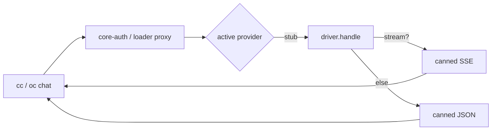

# stub-auth

[](https://www.npmjs.com/package/stub-auth)
[](https://www.npmjs.com/package/stub-auth)
[](https://github.com/intisy-ai/stub-auth/actions)

A stub AI-provider driver for [`core-auth`](https://github.com/intisy-ai/core-auth). It returns canned,
valid Anthropic Messages API responses (JSON or SSE) so the auth pipeline — discovery, routing, and
the per-app adapters in Claude Code and OpenCode — can be validated end to end without contacting any
real provider. It is also the reference **example** for building new provider plugins: define
`{ id, label, models, handle }`, let core-auth do the rest.

## Under-the-Hood Architecture



## Structure

- `src/`
  - `src/driver.ts` — the provider: `id`/`label`/`models` + `handle()` returning the canned response.
  - `src/index.ts` — OpenCode entry (`defineProvider(driver).opencode`).
  - `src/handler.ts` — Claude entry (the named `handle` the loader proxy calls).
  - `src/commands.ts` — cross-app slash-commands (the reference example of the command framework).
  - `core-auth/`, `core/` — git submodules (auth engine; shared config/logging/commands), bundled in.
- `dist/`
  - `dist/index.js` + `dist/handler.js` — esbuild bundles the submodules in, producing self-contained entries; not committed.

## Installation

### Via plugin-updater (recommended)

```bash
npx plugin-updater@latest init https://github.com/intisy-ai/stub-auth
```

### Via npm

```bash
npm install stub-auth
```

## Selecting the Stub Provider

After installing, pick **Stub** in the loader's Providers tab (`cc auth`) or run `oc auth login` and select a `stub/...` model. The active provider is stored by the loader.

## Configuration

Config file: `<configDir>/config/stub-auth.json` (edit via the loader or `/stub-auth-config set`).

```json
{
  "logging": true,
  "response_text": "Hello from stub-auth — the core-auth pipeline works end to end.",
  "model_count": 3,
  "latency_ms": 0,
  "fail_rate": 0,
  "streaming": null
}
```

| Key | Default |
| --- | --- |
| `logging` | `true` |
| `response_text` | `"Hello from stub-auth — the core-auth pipeline works end to end."` |
| `model_count` | `3` |
| `latency_ms` | `0` |
| `fail_rate` | `0` |
| `streaming` | `null` |

## Commands

| Command | Description | Arguments |
| --- | --- | --- |
| `/stub-auth-config` | View and change stub-auth configuration | `list | get <key> | set <key> <value>` |
| `/stub-accounts` | List stub-auth demo accounts |  |

## Dependencies

- `core`
- `core-auth`

## Logging

Logs are written to `<configDir>/logs/YYYY-MM-DD/stub-auth-HH-MM-SS.log` and are toggled by
this plugin's `logging` config (default on). Console mirroring is global, off by default,
and controlled by the shared `config/settings.json` `logConsole` flag.

## License

MIT.
