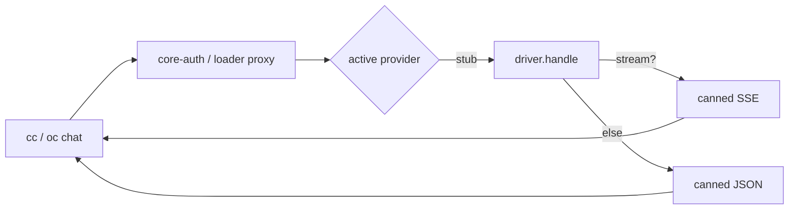

# stub-auth

[](https://www.npmjs.com/package/stub-auth)
[](https://www.npmjs.com/package/stub-auth)
[](https://github.com/intisy-ai/stub-auth/actions/workflows/publish.yml)

A stub AI-provider driver for [`core-auth`](https://github.com/intisy-ai/core-auth). It returns canned,
valid Anthropic Messages API responses (JSON or SSE) so the auth pipeline — discovery, routing, and
the per-app adapters in Claude Code and OpenCode — can be validated end to end without contacting any
real provider. It is also the reference **example** for building new provider plugins: define
`{ id, label, models, handle }`, let core-auth do the rest.

## Under-the-Hood Architecture



## Structure

- `src/driver.ts` — the provider: `id`/`label`/`models` + `handle()` returning the canned response.
- `src/index.ts` — OpenCode entry (`defineProvider(driver).opencode`).
- `src/handler.ts` — Claude entry (the named `handle` the loader proxy calls).
- `dist/` — esbuild bundles core-auth in, producing self-contained `index.js` + `handler.js`.

## Installation

### Via plugin-updater (primary)

```bash
npx -y plugin-updater@latest add https://github.com/intisy-ai/stub-auth
```

Then pick **Stub** in the loader's Providers tab (`cc auth`) / `oc auth login`.

### Via npm

```bash
npm install stub-auth
```

## Configuration

`stub-auth` has no settings of its own. The active provider is stored by the loader; OpenCode selects
it via `oc auth login` + a `stub/...` model.

## Logging

Request routing is logged by the loader/core-auth under `<configDir>/logs/YYYY-MM-DD/`.

## License

MIT
